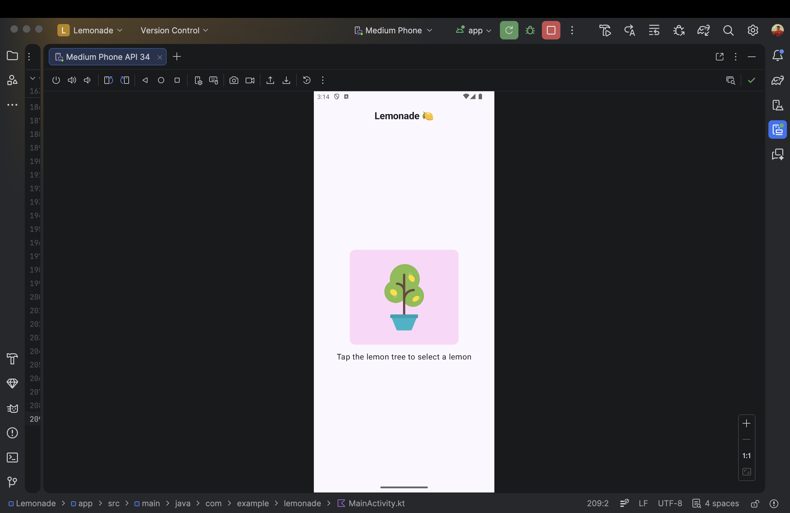
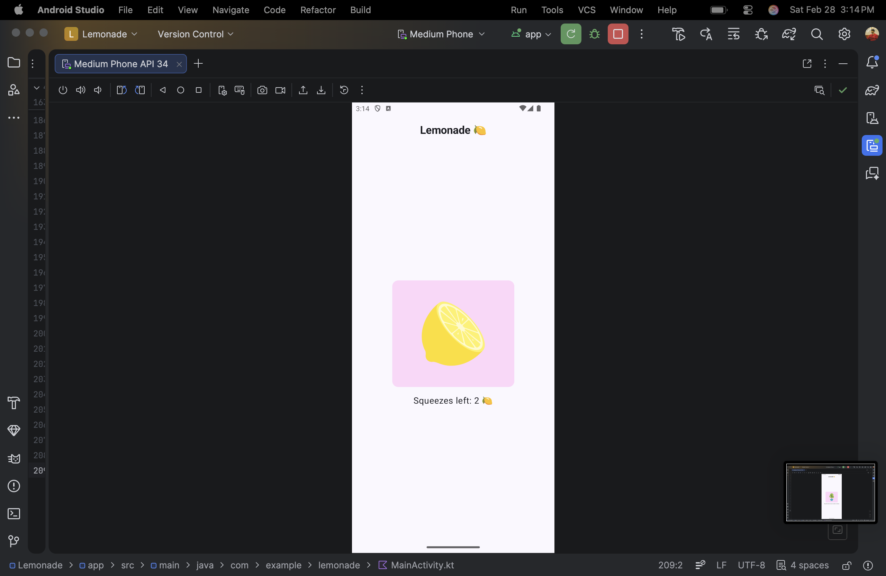
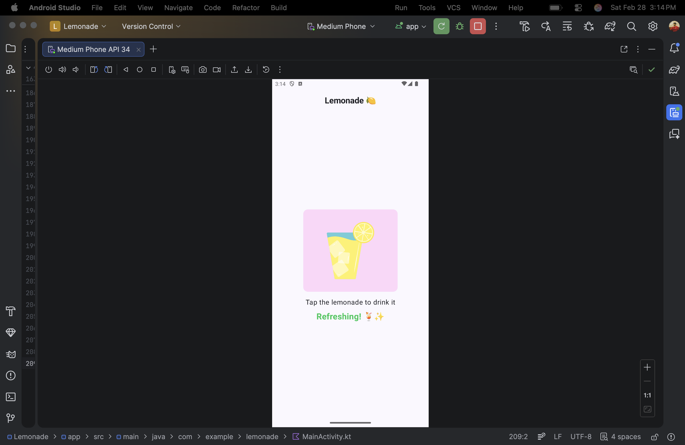
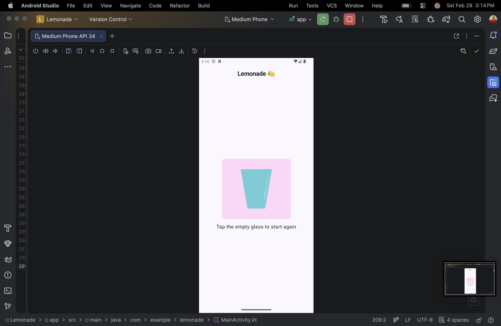

# 🍋 Lemonade App – Jetpack Compose

An interactive Lemonade Android application built using **Kotlin** and **Jetpack Compose**.

This app guides users through the fun process of making lemonade:
selecting a lemon 🍋, squeezing it multiple times, drinking it 🍹, and restarting.

---

## 🚀 Features

- 4 interactive UI states
- Random squeeze count (2–4 taps)
- Live squeeze counter
- Animated lemon while squeezing
- Celebration message when lemonade is ready
- Clean Material 3 UI

---

## 📱 UI Preview

### Step 1 – Select Lemon

### Step 2 – Squeeze Lemon

### Step 3 – Drink Lemonade

### Step 4 – Restart

---

## 🛠 Tech Stack

- Kotlin
- Jetpack Compose
- Material 3
- Android Studio

---

## 🎯 Learning Outcomes

This project helped me understand:

- State management using `remember` & `mutableStateOf`
- Recomposition in Jetpack Compose
- Random logic handling
- Passing lambdas to composables
- Building reusable composable components
- Animations using `animateFloatAsState`

---

## 👨‍💻 Author

**Fahad Umar Farooq**  
Android Developer | Jetpack Compose Enthusiast 🚀

---

## ⭐ Future Improvements

- Add confetti animation
- Add squeeze sound effects
- Add total lemonade counter
- Add dark mode toggle
- Improve tablet responsiveness

---

### 🍹 Built as part of my Android + Compose learning journey.
